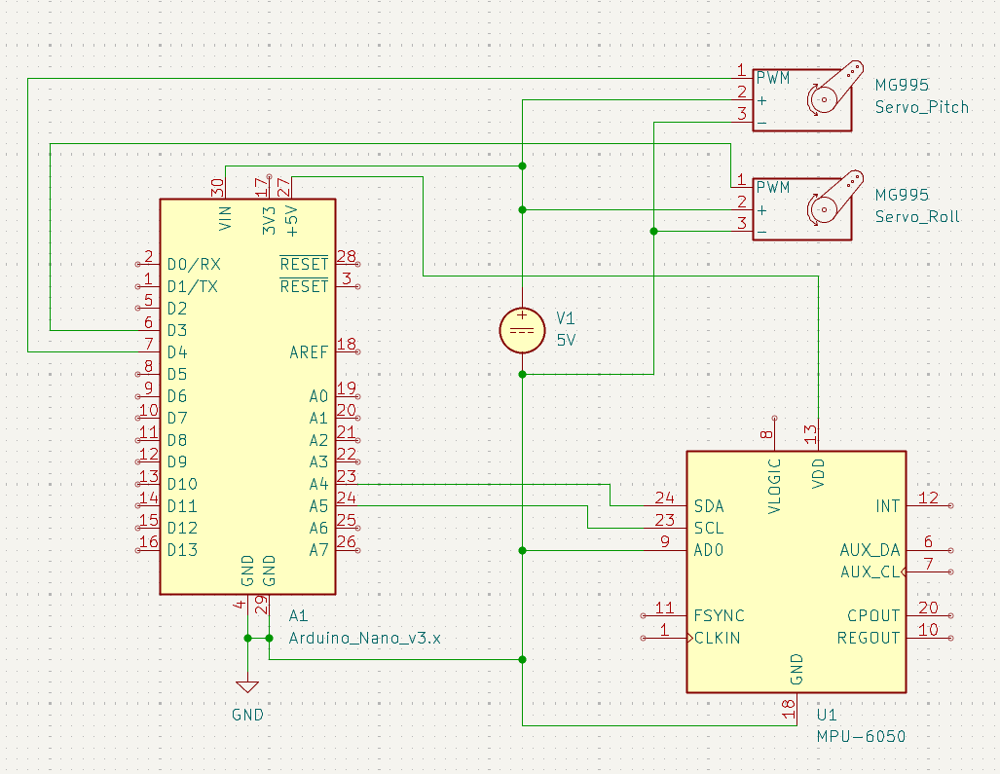

# 2-axis gimbal
### | arduino nano | mpu-6050 | 2x mg995 | 5v supply |

Self stabilizing axis gimbal project using i2cdevlib for simple development focusing on the Pitch and Roll controll logic and smoothening algorithm.

---

## Hardware

| Component | Details |
|-|-|
| Microcontroller | Arduino Nano |
| IMU | MPU-6050 (i2c) |
| Servos | 2x mg995 |
| Power | 5V3A barrel jack + usb for nano |

---
## Schematic

>

---
## Demonstration

>

---
## Code

> Currently has dependency on the i2cdevlib library for simplifying and cleaning up code. Might remove in the future.

| Dependencies |
|-|
|I2Cdev.cpp|
|I2Cdev.h|
|MPU6050.cpp|
|MPU6050.h|
|helper_3dmath.h|